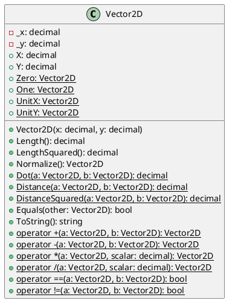
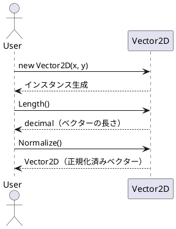
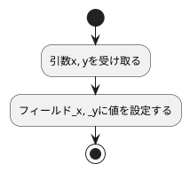
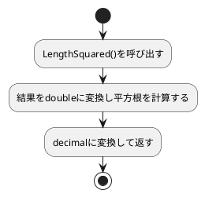
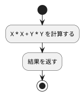
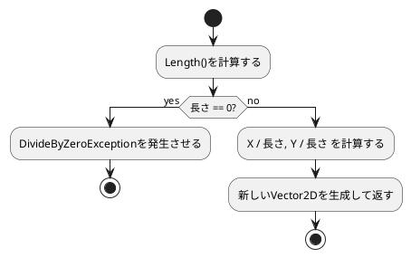
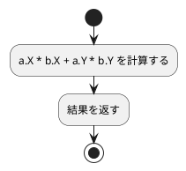
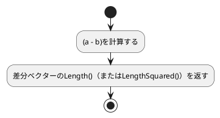
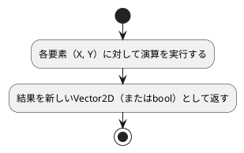

## 改訂履歴

| バージョン |    日付    |    作成者    |   内容   | テンプレートバージョン |
| :--------: | :--------: | :----------: | :------: | :--------------------: |
|   1.0.0    | 2026/09/04 | Shunya Yokoi | 新規作成 |         1.0.0          |

## 関連要件

- [REQ-0001-Vector2D.md](../Requirements/REQ-0001-Vector2D.md)

---

## 1. 機能名

|       種別       |    名称    |
| :--------------: | :--------: |
| 機能名（日本語） | ベクター2D |
|     クラス名     | `Vector2D` |

## 2. 機能の概要

標準で提供される `System.Numerics.Vector2` と同様の処理を持ち、`float` 型の代わりに `decimal` 型でフィールドやプロパティを定義したモデルクラス。
2次元座標（X, Y）を表現し、加算・減算・乗算・除算・内積・長さ・正規化などのベクター演算を提供する。

### 2.1. クラス図

### 2.2. シーケンス図

## 2.3. 依存関係

|        種類        | 名称                      | 用途                                               |
| :----------------: | :------------------------ | :------------------------------------------------- |
| .NET標準ライブラリ | `System`                  | `decimal` 演算、`Math` 相当の計算処理              |
| .NET標準ライブラリ | `System.Numerics.Vector2` | 挙動を参考にするための互換対象（直接依存はしない） |

---

## 3. クラス設計詳細

### 3.1. クラス／インターフェース名: `Vector2D`

#### 概要

2次元ベクターを表す不変（イミュータブル）な値型クラス。`float` の精度不足を避けるため、内部の座標値を `decimal` 型で保持する。
`System.Numerics.Vector2` と同様のAPI（演算子オーバーロード、静的ファクトリ、長さ・内積・正規化などのメソッド）を提供する。

---

#### フィールド一覧

| フィールド名 |    型     | アクセス修飾子 | 説明                          |
| :----------: | :-------: | :------------: | :---------------------------- |
|     `_x`     | `decimal` |   `private`    | X座標の値を保持するフィールド |
|     `_y`     | `decimal` |   `private`    | Y座標の値を保持するフィールド |

---

#### プロパティ一覧

| プロパティ名 |    型     | アクセス修飾子 | 説明                          |
| :----------: | :-------: | :------------: | :---------------------------- |
|     `X`      | `decimal` |    `public`    | X座標の値を取得するプロパティ |
|     `Y`      | `decimal` |    `public`    | Y座標の値を取得するプロパティ |

---

#### 定数一覧

| 定数名 | 型  | 値  | アクセス修飾子 | 説明                           |
| :----: | :-: | :-: | :------------: | :----------------------------- |
|  なし  |  -  |  -  |       -        | このクラスには定数は定義しない |

---

#### メソッド一覧

| メソッド名                   | 説明                                                            |
| :--------------------------- | :-------------------------------------------------------------- |
| `Vector2D(decimal, decimal)` | X座標・Y座標を指定してインスタンスを生成するコンストラクタ      |
| `Length`                     | ベクターの長さ（大きさ）を計算する                              |
| `LengthSquared`              | ベクターの長さの2乗を計算する（平方根演算を避けたい場合に使用） |
| `Normalize`                  | ベクターを正規化した新しいベクターを返す                        |
| `Dot`（静的）                | 2つのベクターの内積を計算する                                   |
| `Distance`（静的）           | 2点間の距離を計算する                                           |
| `DistanceSquared`（静的）    | 2点間の距離の2乗を計算する                                      |
| `Equals`                     | 他のベクターと値が等しいかどうかを判定する                      |
| `ToString`                   | ベクターの文字列表現を取得する                                  |
| 演算子 `+`                   | ベクターの加算                                                  |
| 演算子 `-`                   | ベクターの減算                                                  |
| 演算子 `*`                   | ベクターとスカラー値の乗算                                      |
| 演算子 `/`                   | ベクターとスカラー値の除算                                      |
| 演算子 `==` / `!=`           | ベクターの等価比較                                              |

---

#### コンストラクタ `Vector2D(decimal x, decimal y)`

##### メソッド概要

X座標とY座標を指定して `Vector2D` のインスタンスを生成する。

---

##### アクセス修飾子

`public`

##### 引数

| 引数名 |    型     | 入出力 | 説明      |
| :----: | :-------: | :----: | :-------- |
|  `x`   | `decimal` |   IN   | X座標の値 |
|  `y`   | `decimal` |   IN   | Y座標の値 |

##### 戻り値

|     型     | 説明                   |
| :--------: | :--------------------- |
| `Vector2D` | 生成されたインスタンス |

##### 例外

| 例外の種類 | 説明             |
| :--------: | :--------------- |
|    なし    | 例外は発生しない |

##### フローチャート図

---

#### メソッド `Length`

##### メソッド概要

現在のベクターの長さ（原点からの距離）を計算して返す。
`decimal` 型には平方根演算が標準で存在しないため、内部で `double` に変換して計算した結果を `decimal` に戻す。

---

##### アクセス修飾子

`public`

##### 引数

なし

##### 戻り値

|    型     | 説明           |
| :-------: | :------------- |
| `decimal` | ベクターの長さ |

##### 例外

| 例外の種類 | 説明             |
| :--------: | :--------------- |
|    なし    | 例外は発生しない |

##### フローチャート図

---

#### メソッド `LengthSquared`

##### メソッド概要

ベクターの長さの2乗を計算する。平方根計算を避けたい比較処理などで利用する。

---

##### アクセス修飾子

`public`

##### 引数

なし

##### 戻り値

|    型     | 説明                    |
| :-------: | :---------------------- |
| `decimal` | ベクターの長さの2乗の値 |

##### 例外

| 例外の種類 | 説明             |
| :--------: | :--------------- |
|    なし    | 例外は発生しない |

##### フローチャート図

---

#### メソッド `Normalize`

##### メソッド概要

ベクターを正規化（長さを1にする）した新しい `Vector2D` インスタンスを返す。

---

##### アクセス修飾子

`public`

##### 引数

なし

##### 戻り値

|     型     | 説明                 |
| :--------: | :------------------- |
| `Vector2D` | 正規化されたベクター |

##### 例外

|       例外の種類        | 説明                              |
| :---------------------: | :-------------------------------- |
| `DivideByZeroException` | ベクターの長さが0の場合に発生する |

##### フローチャート図

---

#### メソッド `Dot`（静的）

##### メソッド概要

2つのベクターの内積を計算する。

---

##### アクセス修飾子

`public static`

##### 引数

| 引数名 |     型     | 入出力 | 説明            |
| :----: | :--------: | :----: | :-------------- |
|  `a`   | `Vector2D` |   IN   | 1つ目のベクター |
|  `b`   | `Vector2D` |   IN   | 2つ目のベクター |

##### 戻り値

|    型     | 説明     |
| :-------: | :------- |
| `decimal` | 内積の値 |

##### 例外

| 例外の種類 | 説明             |
| :--------: | :--------------- |
|    なし    | 例外は発生しない |

##### フローチャート図

---

#### メソッド `Distance`（静的） / `DistanceSquared`（静的）

##### メソッド概要

2点間の距離、または距離の2乗を計算する。

---

##### アクセス修飾子

`public static`

##### 引数

| 引数名 |     型     | 入出力 | 説明      |
| :----: | :--------: | :----: | :-------- |
|  `a`   | `Vector2D` |   IN   | 1つ目の点 |
|  `b`   | `Vector2D` |   IN   | 2つ目の点 |

##### 戻り値

|    型     | 説明                    |
| :-------: | :---------------------- |
| `decimal` | 距離（または距離の2乗） |

##### 例外

| 例外の種類 | 説明             |
| :--------: | :--------------- |
|    なし    | 例外は発生しない |

##### フローチャート図

---

#### 演算子オーバーロード（`+`, `-`, `*`, `/`, `==`, `!=`）

##### メソッド概要

`Vector2D` 同士の加算・減算・比較、および `Vector2D` とスカラー値（`decimal`）の乗算・除算を行う演算子。

---

##### アクセス修飾子

`public static`

##### 引数

|    引数名     |          型           | 入出力 | 説明                                        |
| :-----------: | :-------------------: | :----: | :------------------------------------------ |
|      `a`      |      `Vector2D`       |   IN   | 演算対象の1つ目のベクター                   |
| `b`／`scalar` | `Vector2D`／`decimal` |   IN   | 演算対象の2つ目のベクター、またはスカラー値 |

##### 戻り値

|         型         | 説明                               |
| :----------------: | :--------------------------------- |
| `Vector2D`／`bool` | 演算結果のベクター、または比較結果 |

##### 例外

|       例外の種類        | 説明                                      |
| :---------------------: | :---------------------------------------- |
| `DivideByZeroException` | 除算演算子でスカラー値が0の場合に発生する |

##### フローチャート図

---

## 4. 注意事項・制約事項

- `decimal` 型は `System.Numerics.Vector2` の `float` 型と異なり、平方根演算（`Math.Sqrt`）を直接扱えないため、`Length` メソッド内部では一時的に `double` へ変換して計算する。そのため、極端に大きい／小さい値では `double` の精度上限に依存した誤差が生じる可能性がある。
- 本クラスは不変（イミュータブル）オブジェクトとして設計し、フィールドの変更を許可しない（`X`, `Y` は読み取り専用プロパティとする）。
- 値型としての意味合いが強いため、将来的に `struct` として実装することも検討可能（拡張性を考慮した設計とする）。
- `Normalize` メソッド、除算演算子はゼロ除算に注意が必要であり、呼び出し元で長さやスカラー値が0でないことを確認することを推奨する。

---
