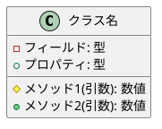
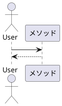
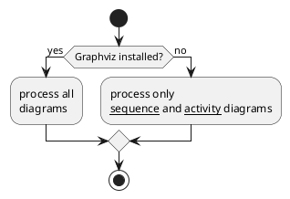

# 機能名 設計書

## 改訂履歴

| バージョン |    日付    |    作成者    |   内容   | テンプレートバージョン |
| :--------: | :--------: | :----------: | :------: | :--------------------: |
|   1.0.0    | 2026/08/28 | Shunya Yokoi | 新規作成 |         1.0.0          |

## 関連要件

- 関連する要件定義書を記載すること

---

## 1. 機能名

|       種別       | 名称 |
| :--------------: | :--: |
| 機能名（日本語） |      |
|     クラス名     |      |

## 2. 機能の概要

機能の概要を記載すること

### 2.1. クラス図

### 2.2. シーケンス図

## 2.3. 依存関係

|                     種類                     | 名称          | 用途                               |
| :------------------------------------------: | :------------ | :--------------------------------- |
| 種別を記載すること（.NET標準ライブラリなど） | `System.Text` | 何に使用しているのかを記載すること |

---

## 3. クラス設計詳細

### 3.1. クラス／インターフェース名

#### 概要

クラスまたはインターフェースの概要を記載すること

---

#### フィールド一覧

|        フィールド名        |  型   | アクセス修飾子 | 説明             |
| :------------------------: | :---: | :------------: | :--------------- |
| フィールド名を記載すること | `int` |   `private`    | フィールドの説明 |

---

#### プロパティ一覧

|        プロパティ名        |  型   | アクセス修飾子 | 説明             |
| :------------------------: | :---: | :------------: | :--------------- |
| プロパティ名を記載すること | `int` |   `private`    | プロパティの説明 |

---

#### 定数一覧

|        定数名        |  型   |   値   | アクセス修飾子 | 説明       |
| :------------------: | :---: | :----: | :------------- | ---------- |
| 定数名を記載すること | `int` | `1000` | `private`      | 定数の説明 |

---

#### メソッド一覧

| メソッド名   | 説明                     |
| :----------- | :----------------------- |
| `メソッド名` | 簡単な説明を記述すること |

---

#### メソッド名

##### メソッド概要

メソッドの概要を記載すること

---

##### アクセス修飾子

アクセス修飾子を記載すること

##### 引数

|       引数名       |  型   |      入出力      | 説明       |
| :----------------: | :---: | :--------------: | :--------- |
| 引数を記載すること | `int` | IN／OUT／REFなど | 引数の説明 |

##### 戻り値

|  型   | 説明         |
| :---: | :----------- |
| `int` | 戻り値の説明 |

##### 例外

|   例外の種類    | 説明                                 |
| :-------------: | :----------------------------------- |
| `Exception`など | 例外の発生する状況などを記載すること |

##### フローチャート図

---

#### メソッド2名

##### メソッド概要

メソッドの概要を記載すること

---

##### アクセス修飾子

アクセス修飾子を記載すること

##### 引数

|       引数名       |  型   |      入出力      | 説明       |
| :----------------: | :---: | :--------------: | :--------- |
| 引数を記載すること | `int` | IN／OUT／REFなど | 引数の説明 |

##### 戻り値

|  型   | 説明         |
| :---: | :----------- |
| `int` | 戻り値の説明 |

##### 例外

|   例外の種類    | 説明                                 |
| :-------------: | :----------------------------------- |
| `Exception`など | 例外の発生する状況などを記載すること |

##### フローチャート図

---
